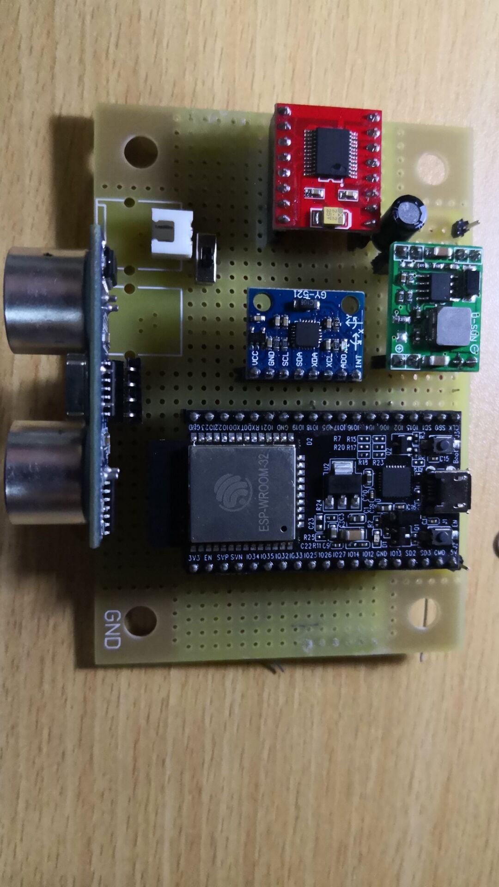

# Log of Self-Balance-Robot Project

## 9.10

项目开始

## 9.24

__组会__ ：第一批器件送达，小车底座搭建完毕

## 10.08

myRIO方案舍弃，确定主控板为ESP32-DevkitC

## 10.15

代码框架初步建立，远程控制方案：TCP双端口透传

## 10.17

面包板模型搭建完毕，小车平衡

## 10.18

__组会__：制作洞洞板

## 11.02

洞洞板焊接完成

## 11.03

__第一次汇报__

## 11.06 - 11.08

PCB绘制，外发加工

## 11.12

__第二次汇报__：远程控制策略由TCP换为Web

## 11.17 - 11.18

PCB焊装完成，机械结构完成

## 11.19

__第三次汇报__

### Issues
- Issue1: 稳压模块稳压偏低（4.85V）
- Issue2: TB6612FNG驱动模块逻辑电平为CMOS电平，高电平门限为0.7*VCC。若VCC供5V，则逻辑高为3.5V，ESP32 IO口输出高电平3.3V（实测3.4+），可能出现电平不匹配
- Issue3: 树莓派供电问题：从PCB板上取电时，供电电流无法支持USB口识别角蜂鸟
- `Issue4` : 电机接线接口接触不良（电机停转，编码器不工作导致速度环失控）

### Solutions
- Issue1 与 Issue2 抵消，故不做处理
- Issue3：增加10000mAh充电宝对树莓派供电

## 11.22

- 机械结构重组完成，增加充电宝
- Web服务器调参页面初步完成
- 树莓派UART通信成功

## 11.23

- 修复程序重大bug：平衡环中角速度取值错误，原为y轴角速度（gyroy），应改为x轴角速度（gyrox）
- Web服务器调参页面重构

### Issues
- `Issue5` : 两轮速度不一致，小车易打转（疑因电机接线接触不良导致该问题变严重）
- Issue6 : Web服务器端易超时
- `Issue7` : VNC与树莓派通信效果不佳

### Solutions
- Issue6 : 使用[ESPAsyncWebServer](https://github.com/me-no-dev/ESPAsyncWebServer)

## 11.24

- 增加运动控制(前进，后退，原地打转)
- 确认 `Issue5` 原因为机械结构上左右重量不一致，考虑在程序上利用转向环进行修正，参数还在调节

## 11.26

__第四次汇报__

- `Issue5` 可能原因为车轮机械组装，待下次组会处理
- 增加避障模式（基于有限状态机实现，逻辑较简单），未进行详细测试
