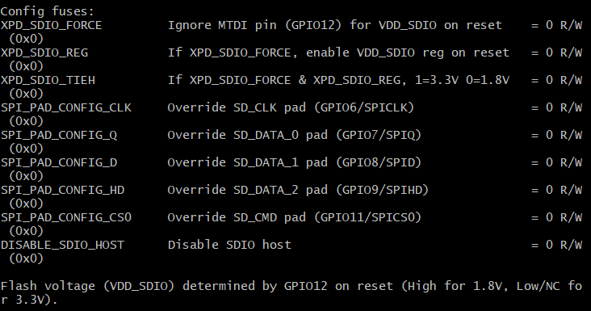

# Log of Self-Balance-Robot Project

## 9.10

项目开始

## 9.24

__组会__ ：第一批器件送达，小车底座搭建完毕


## 10.08

myRIO方案舍弃，确定主控板为ESP32-DevkitC

## 10.15

代码框架初步建立，远程控制方案：TCP双端口透传

## 10.17

面包板模型搭建完毕，小车平衡


## 10.18

__组会__：制作洞洞板

## 11.02

洞洞板焊接完成


## 11.03

__第一次汇报__

## 11.06 - 11.08

PCB绘制，外发加工

## 11.12

__第二次汇报__：远程控制策略由TCP换为Web

## 11.17 - 11.18

PCB焊装完成，机械结构完成

## 11.19

__第三次汇报__


### Issues
- Issue1: 稳压模块稳压偏低（4.85V）
- Issue2: TB6612FNG驱动模块逻辑电平为CMOS电平，高电平门限为0.7*VCC。若VCC供5V，则逻辑高为3.5V，ESP32 IO口输出高电平3.3V（实测3.4+），可能出现电平不匹配
- Issue3: 树莓派供电问题：从PCB板上取电时，供电电流无法支持USB口识别角蜂鸟
- `Issue4` : 电机接线接口接触不良（电机停转，编码器不工作导致速度环失控）

### Solutions
- Issue1 与 Issue2 抵消，故不做处理
- Issue3：增加10000mAh充电宝对树莓派供电

## 11.22

- 机械结构重组完成，增加充电宝
- Web服务器调参页面初步完成
- 树莓派UART通信成功

## 11.23

- 修复程序重大bug：平衡环中角速度取值错误，原为y轴角速度（gyroy），应改为x轴角速度（gyrox）
- Web服务器调参页面重构

### Issues
- `Issue5` : 两轮速度不一致，小车易打转（疑因电机接线接触不良导致该问题变严重）
- Issue6 : Web服务器端易超时
- `Issue7` : VNC与树莓派通信效果不佳

### Solutions
- Issue6 : 使用[ESPAsyncWebServer](https://github.com/me-no-dev/ESPAsyncWebServer)

## 11.24

- 增加运动控制(前进，后退，原地打转)
- 确认 `Issue5` 原因为机械结构上左右重量不一致，考虑在程序上利用转向环进行修正，参数还在调节

## 11.26

__第四次汇报__

- `Issue5` 可能原因为车轮机械组装，待下次组会处理
- 增加避障模式（基于有限状态机实现，逻辑较简单），未进行详细测试

## 11.29

__组会__

- 修复程序中转向环偏置量使用时的逻辑错误
- 避障功能测试完毕
- 树莓派与ESP32通信建立，巡线功能开始实现

### Issues
- Issue8 : 树莓派端疑线程调用不当，通信传输慢、卡顿，图片分析算法函数中疑存在越位情况导致的死循环

### Solutuons
- Issue8 : 换用多进程库multiprocess, 完善进程间变量的共享

## 12.02

- Web页面重构，简化代码，提高复用率
    + 方向控制按键修改为按下运动，弹起停止
        ```
        PC端 : mousedown和mouseup事件
        移动端 : touchstart和touchend事件
        需对这四个事件绑定句柄函数
        ```
    + 修改布局，所有元素居中
    + 合并checkbox的句柄函数
    + 运动状态回显部分增加显示 `树莓派端指令` （JSON包中value值为字符串时需使用双引号包裹，否则会解析失败）
- 树莓派端多进程调度完成

### Issues
- Issue9 : Web页面，移动端touch事件结束后mouse事件继续触发
- Issue10 : ESP32与树莓派通信时使用了Pin12，而Pin12与芯片上电时flash voltage regulator的使能相关。故树莓派上电工作时，ESP32无法正常进入工作状态
    ```
    After reset, the default ESP32 behaviour is to enable and configure the flash voltage regulator (VDD_SDIO) based on the level of the MTDI pin (GPIO12).
    ```



### Solutuons
- Issue9 : 在touchend事件句柄函数中禁用事件默认功能
- Issue10 : 利用[espefuse-setting-flash-voltage](https://github.com/espressif/esptool/wiki/espefuse#setting-flash-voltage-vdd_sdio)工具烧断熔丝，将flash voltage直接设置为3.3V，则上电时Pin12的电平情况与flash voltage regulator无关(__此操作不可逆__)


